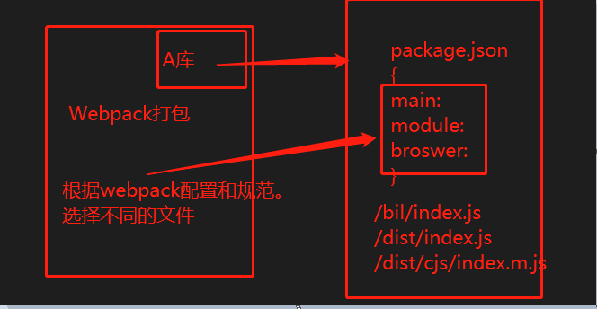

规范
-----------


  * 包使用环境
    * 只容许服务端使用 web 
    * 只容许客户端使用 本地node
    * 服务端和客服端都可以使用。
  
  * 目前规范 esm 、cjs 占据主流，其中：
    ```
    esm ：现代 ECMA 规范，摇树性能好，首推使用
    cjs ：node 使用的 require 规范，无摇树
    umd : 适用于前端和后端环境 (一种模式，去适配多种模块系统)
    ```

  * 文件后缀
    * js/mjs
    ```
      nodejs 使用commonjs 规范,为了让nodejs使用esm规范,需要使用mjs文件后缀
      require('./util/index') // 会首选加载mjs然后才会是js 
    ```
    
      
  * A库package.json browser，module 和 main 字段
    * main  定义了 npm 包的入口文件，browser 环境和 node 环境均可使用
    * module 定义 npm 包的 ESM 规范的入口文件，browser 环境和 node 环境均可使用
    * browser : 定义 npm 包在 browser 环境下的入口文件。
    ```
    三个字段为了声明，不同导入方式被加载的不同文件
    import React from 'react'
    {
      main:'./index.js',
      module:"./index.js",
    }
    ```
    * 详解 [GO](https://github.com/SunshowerC/blog/issues/8)-[GO2](https://github.com/tianyn1990/blog/issues/1) And [同见](https://webpack.docschina.org/configuration/resolve/#resolvemainfields)
      ```
      "main": "lib/index.js",  // main 
      "module": "lib/index.mjs", // module
      // browser 可定义成和 main/module 字段一一对应的映射对象，也可以直接定义为字符串
      "browser": {
        "./lib/index.js": "./lib/index.browser.js", // browser+cjs
        "./lib/index.mjs": "./lib/index.browser.mjs"  // browser+mjs
      },
      "browser": "./lib/index.browser.js" // browser
      ```
      可以有五种入口文件：
      ```
      * main
      * module
      * browser
      * browser+cjs
      * browser+mjs
      ```
  * 业务。 Webpack 打包场景 或者node运行环境。根据环境，打包的时候引用不同的文件

    * 场景1 webpack + web +esm规范
    * 场景2 webpack + web + commonJS规范
      ```
      加载顺序为  (browser = browser+mjs) > module > browser+cjs > main
      ```
    * 参加3 webpack + node + ESM/commonJS
      ```
        webpack.config.json
        target：node

        优先级是： module > main
      ```
    * 场景4 node + commonJS 规范
      ```
      仅 main 有效
      ```
    * 场景5 node + esm 规范
      ```
      node --experimental-modules test.mjs 必须为mjs
      仅 main 有效
      ```
  * 总结
    * rxjs vue 都只使用module + main


* main/module/browser 见上 [选用流程](./50725620-02d88e00-113b-11e9-8065-12fd12c6360a.png)
  * import * A from 'Alib'。点进去看和最后编译的可能不是同一个文件。打包时决定
  * 声明不同环境下 被 加载的文件
  * dome 
    * 仅仅支持web 使用 main/module 即可 webpack.target='web'module>main
    * 仅仅支持node 使用 module/main 即可 webpack.target='node'
      * module esm规范
      * main commonJS规范
    * web/node 
      * 相同输出 使用 module/main
      * 不同输出 使用 browser+main+module 
        ```
          {
            "main": "lib/index",
            "module": "lib/index.mjs",
            "browser": {
              "./lib/index.js": "./lib/index.browser.js",
              "./lib/index.mjs": "./lib/index.browser.mjs"
            }
          }
        target:'web',
          1:检查 module 有
          2:检查 browser 有，并且为对象
          3:使用 browser[module]
        target:'node'
          选用 module
        ```
* unpkg 
* files
  ```
  你的git 可能会包含很多测试文件或者dome

  npm i xx  
  仅仅拉取 files指定的文件或者目录
  {
    "files":[
      "index.js",
      "index.d.ts",
      "core",
      "dist/**/a.index.js"
    ]
  }
  ```
* exports 支持分类导入 会替换mian , module , browser字段

  ```
  //=== main:'index.js'
  {
    "exports":{
      ".":{
        "types":"index.d.ts",
        "require":"index.js",//打包node运行 webpack.target='node' commonjs规范
        "import":"index.js"// 打包为web webpack.target='web' esm规范
        "module":'index.js',// 如果存在 使用其 为web/node(兼容esm)进行打包
 
        "default": "./dist/esm-browser/index.js",// 没有申明的使用这个 这个例子的 browser 没有申明。
        "import":{
          "node":"",
          "default":"index.js"
        }
        "node":{//'webpack target:"node"''
          "require": "a.js",
          "import": "b.js"
        }
      }  
    }
  }
  ```
  ```
    多个文件导出
    import {} from 'rxjs'
    import {} from 'rxjs/operators'

    ├── operators/
    │   ├── index.js
    │   ├── index.d.ts
    │   ├──package-2.json
    ├── package.json
    └── index.js
    └── index.d.ts

    package.json
    {
      "exports":{
        "./package.json": "./package.json",// 必须
        ".":{
          "types":"index.d.ts",
          "require":"index.js",
          "import":"index.js"
        },
        "./operators":{
          "types": "./operators/index.d.ts", 
          "require": "./operators/index.js",//另： "../dist/aaa/bb/index.d.js"
          "import": "./operators/index.js"
        }
      }
    }


    package-2.json
    {
      "name":"rxjs/operators"
      "main": "./index.js",
      "module": "./index.js"
    }
    {
      // 可再次指定文件
      "name":"rxjs/operators"
      "main": "../dist/aaa/index.js",
      "module": "./dist/bbb/index.mjs"
    }
  ```
  * dome 
    ```
    //'uuid' 
     "exports": {
        ".": {
          "node": {
            "module": "./dist/esm-node/index.js",
            "require": "./dist/index.js",
            "import": "./wrapper.mjs"
          },
          "default": "./dist/esm-browser/index.js"
        },
        "./package.json": "./package.json"
      },
    ```
    ```
    //vue
    "exports": {
      ".": {
        "import": {
          "node": "./index.mjs",
          "default": "./dist/vue.runtime.esm-bundler.js"
        },
        "require": "./index.js",
        "types": "./dist/vue.d.ts"
      },
    }
    ```

  * bundleDependencies 捆绑指定的库 在你的库中
    ```
      flow-a 作为你开发的库
      {
        "bundleDependencies": [
          "react",
          "react-dom",
        ]
      }
    =》某个项目安装你这个库
      {
        node_modules
          flow-a
            node_modules
              react
              react-dom
      }
    // 如果没有设置 或者为false
      {
        node_modules
          flow-a
          react
          react-dom
      }
    ```